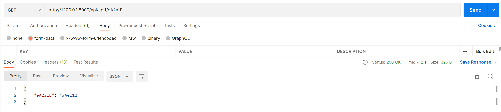
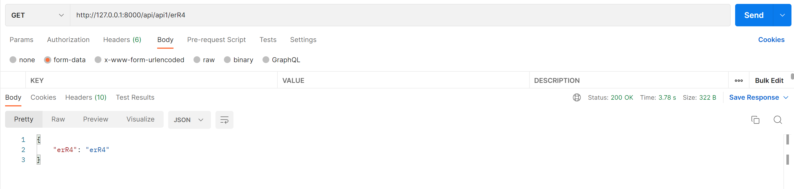
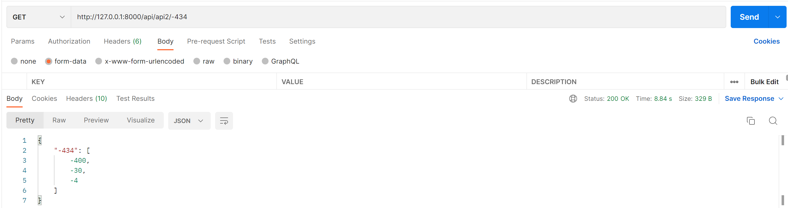
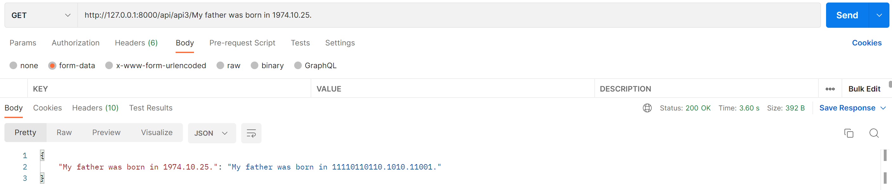
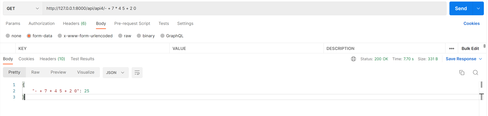

# Laravel APIs implementation

This repo implements the following APIs using Laravel:
* Create an API that receives a string consisting of lowercase letters, uppercase letters and numbers and returns the string sorted (in a JSON object) in the same way as the examples below.
"eA2a1E" ➞ "aAeE12"
"Re4r" ➞ "erR4"
"6jnM31Q" ➞ "jMnQ136"
"846ZIbo" ➞ "bIoZ468"

* Create an API that recives a number $num and returns each place value in the number.
39 ➞ [30, 9]
-434 ➞ [-400, -30, -4]
100 ➞ [100, 0, 0]

* Create an API that translates from Human to Programer by replacing the numbers in a string with their binary form.
"I have 2 sheep." ➞ "I have 10 sheep."
"My father was born in 1974.10.25." ➞ "My father was born in 11110110110.1010.11001."
"10hell76o4 boi" ➞ "1010hell1001100o100 boi"

* Create an API that takes care of Prefix Notation Evaluation.The API receives a mathematical expression in prefix notation as a string and evaluates the expression.
"+ 5 4" ➞ 9
"* 12 2" ➞ 24
"+ -10 10" ➞ 0

# Example screenshots of the output:

